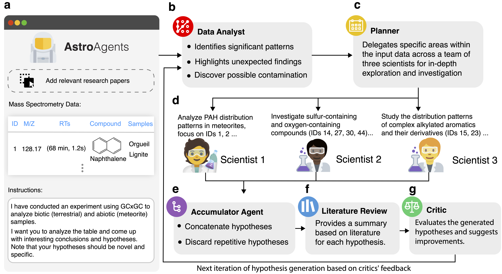

# AstroAgents: Multi-Agent AI for Hypothesis Generation from Mass Spectrometry Data

[](https://astroagents.github.io/)
[](LICENSE)

## Overview

AstroAgents is a large language model-based, multi-agent AI system for hypothesis generation from mass spectrometry data. With upcoming sample return missions across the solar system and the increasing availability of mass spectrometry data, AstroAgents addresses the urgent need for methods that analyze such data within the context of existing astrobiology literature and generate plausible hypotheses regarding the emergence of life on Earth.

<div align="center">
  
  <p><em>Figure 1: AstroAgents System Architecture</em></p>
</div>

## System Architecture

AstroAgents is structured around eight collaborative agents:

1. **Data Analyst**: Interprets the mass spectrometry data
2. **Planner**: Delegates specific data segments to the scientist agents
3. **Domain Scientists** (3): Perform in-depth exploration of data segments
4. **Accumulator**: Collects and deduplicates the generated hypotheses
5. **Literature Reviewer**: Identifies relevant literature using Semantic Scholar
6. **Critic**: Evaluates the hypotheses, offering rigorous suggestions for improvement

## Results

An astrobiology expert evaluated the novelty and plausibility of more than a hundred hypotheses generated from data obtained from eight meteorites and ten soil samples. Surprisingly, 36% were identified as plausible, and among those, 66% were novel.

<div align="center">
  
  <p><em>Generated Hypotheses from Mass Spectrometry Data</em></p>
</div>

## Usage Instructions

### Prerequisites

1. Install the required Python packages:
```bash
pip install -r requirements.txt
```

2. API Keys:
   - Anthropic API key (for Claude model)
   - Google API key (for Gemini model)
   - Semantic Scholar API key

3. Configuration:
   - Copy `config.example.ini` to `config.ini`
   - Add your API keys to the configuration file
```bash
cp config.example.ini config.ini
# Edit config.ini with your API keys
```

### Paper Context Preparation

Before running AstroAgents, you need to prepare paper context from research papers:

1. Create the necessary directories:
```bash
mkdir -p papers/md
```

2. Place your PDF research papers in the `papers/` directory

3. Run the extraction script:
```bash
python extract_text.py
```

This will convert all PDFs to markdown format in the `papers/md/` directory, which will be used by AstroAgents.

### Running AstroAgents

Basic usage:

```bash
python AstroAgents.py --llm_model claude --iterations 10 --anthropic_api_key YOUR_ANTHROPIC_API_KEY --semantic_scholar_api_key YOUR_SEMANTIC_SCHOLAR_API_KEY
```

You can also use the configuration file instead of passing API keys directly:

```bash
python AstroAgents.py --llm_model claude --iterations 10
```

Command-line arguments:

| Argument | Description | Default |
|----------|-------------|---------|
| `--paper_context_file` | Path to the paper context file | `paper_context.md` |
| `--input_prompt_file` | Path to the input prompt file | `prompt.txt` |
| `--llm_model` | LLM model to use (claude or gemini) | `claude` |
| `--iterations` | Number of iterations to run | 10 |
| `--anthropic_api_key` | Anthropic API key | `ANTHROPIC_API_KEY` |
| `--google_api_key` | Google API key | `GOOGLE_API_KEY` |
| `--semantic_scholar_api_key` | Semantic Scholar API key | `SEMANTIC_SCHOLAR_API_KEY` |

## Python Requirements

```
anthropic>=0.7.0
langchain>=0.1.0
langchain-anthropic>=0.1.0
langchain-google-genai>=0.0.5
google-generativeai>=0.3.0
colorama>=0.4.6
requests>=2.31.0
pymupdf4llm>=0.1.0
```

## Citation

If you use AstroAgents in your research, please cite our paper:

```
[Citation information will be added upon publication]
```

## License

This project is licensed under the MIT License - see the [LICENSE](LICENSE) file for details.

## Acknowledgments

- The AstroAgents project website: [https://astroagents.github.io/](https://astroagents.github.io/)
- The Anthropic Claude and Google Gemini teams for their language models
- Semantic Scholar for their API access
