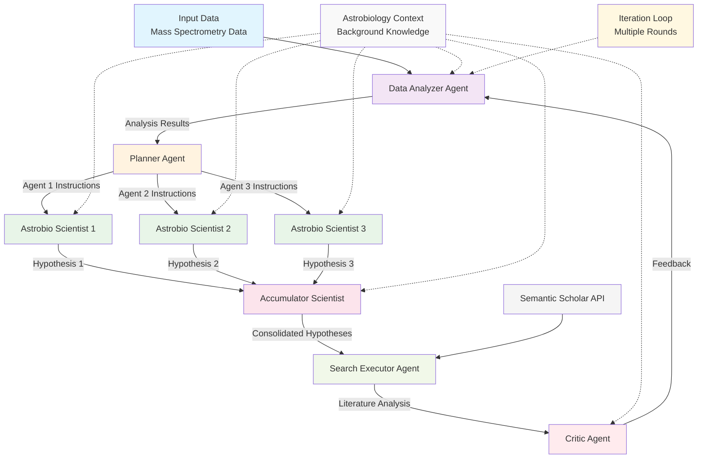
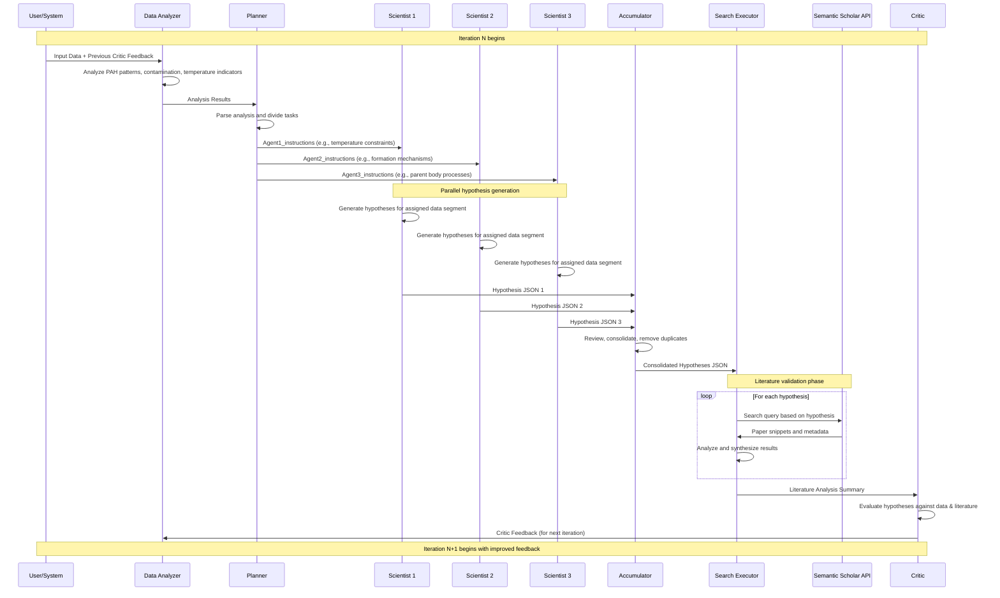

# AstroAgents Multi-Agent System Architecture

This document describes the architecture and flow of the AstroAgents system - a sophisticated multi-agent AI system designed for hypothesis generation from mass spectrometry data in astrobiological research.

## System Overview

The AstroAgents system employs six specialized AI agents that work collaboratively through iterative cycles to analyze meteoritic data and generate novel scientific hypotheses. The system processes mass spectrometry data focusing on PAH (Polycyclic Aromatic Hydrocarbon) distributions and other organic compounds in meteorites.

## Architecture Diagram



## Message Flow Sequence Diagram

The following sequence diagram shows the detailed message exchange between agents during a single iteration cycle:



## Message Exchange Details

### Communication Protocols

The agents communicate through structured message passing with the following key message types:

#### 1. **Input Data Message** (User → Data Analyzer)
```json
{
  "input_data": "Mass spectrometry data with PAH compounds...",
  "critic_feedback": "Previous iteration feedback or empty string"
}
```

#### 2. **Analysis Results Message** (Data Analyzer → Planner)
```json
{
  "analysis": "Detailed analysis of PAH distributions, temperature indicators, contamination patterns..."
}
```

#### 3. **Task Assignment Messages** (Planner → Scientists)
```json
{
  "Agent1_instructions": "Focus on temperature constraints and PAH distribution for compounds X, Y, Z...",
  "Agent2_instructions": "Analyze formation mechanisms and aqueous alteration for samples A, B, C...",
  "Agent3_instructions": "Investigate parent body processes and pre-solar origins for dataset D, E, F..."
}
```

#### 4. **Hypothesis Messages** (Scientists → Accumulator)
```json
{
  "hypothesis": [
    {
      "id": "H_one",
      "statement": "Detailed hypothesis explanation...",
      "key_datapoints": "Specific compound IDs and samples supporting this hypothesis"
    }
  ]
}
```

#### 5. **Consolidated Hypothesis Message** (Accumulator → Search Executor)
```json
{
  "hypothesis": [
    {
      "id": "H_final_one",
      "statement": "Consolidated hypothesis statement...",
      "key_datapoints": "Combined supporting evidence..."
    }
  ]
}
```

#### 6. **Literature Search Results** (Search Executor → Critic)
```json
{
  "search_analysis": "Comprehensive literature review with citations, supporting evidence, and conflicting findings..."
}
```

#### 7. **Critic Feedback Message** (Critic → Data Analyzer)
```text
Detailed scientific critique covering:
- Hypothesis alignment with data
- Scientific evaluation and theoretical foundations  
- Literature integration and comparison
- Novelty and originality assessment
- Specific actionable recommendations
```

### Message Flow Characteristics

- **Synchronous Processing**: Each agent waits for input before proceeding
- **JSON Structured Data**: Hypotheses use standardized JSON format for consistency
- **Iterative Refinement**: Critic feedback loops back to improve next iteration
- **Parallel Execution**: Scientists 1, 2, and 3 process simultaneously
- **External API Integration**: Search Executor communicates with Semantic Scholar API
- **Error Handling**: JSON parsing includes fallback mechanisms for malformed responses
- **Rate Limiting**: 2-second delays between API calls to respect service limits

## Agent Details

### 1. Data Analyzer Agent 🤖
**Role**: Primary data analyst and pattern detector

**Functions**:
- Analyzes mass spectrometry data focusing on astrobiological patterns
- Identifies PAH distributions and alkylation patterns
- Detects environmental contamination signatures
- Highlights unusual temperature indicators
- Compares different meteorite classes
- Incorporates critic feedback to refine analysis

**Input**: Raw data + critic feedback from previous iterations  
**Output**: Structured analysis of patterns and trends

### 2. Planner Agent 📝
**Role**: Strategic coordinator and task delegator

**Functions**:
- Analyzes the data analysis results
- Divides complex data into focused research areas
- Assigns specific instructions to each of the three astrobio scientists
- Ensures comprehensive coverage without overlap
- Coordinates workflow between specialist agents

**Input**: Data analysis + critic feedback + input data  
**Output**: JSON instructions for three specialist agents

### 3. Astrobio Scientist Agents (3 Specialists) 🧬
**Role**: Specialized hypothesis generators

**Common Functions**:
- Generate novel hypotheses based on assigned data segments
- Focus only on delegated data portions
- Provide detailed scientific explanations
- Reference specific datapoints and compound IDs
- Avoid contamination-related hypotheses

**Typical Specializations**:
- **Scientist 1**: Temperature constraints and PAH distributions
- **Scientist 2**: Formation mechanisms and aqueous alteration
- **Scientist 3**: Parent body processes and pre-solar origins

**Input**: Specific instructions + analysis + critic feedback + assigned data  
**Output**: JSON-formatted hypotheses with supporting evidence

### 4. Accumulator Scientist Agent 🔄
**Role**: Hypothesis consolidator and curator

**Functions**:
- Reviews hypotheses from all three scientists
- Eliminates redundant or repetitive hypotheses
- Maintains hypothesis quality and diversity
- Ensures multiple viable hypotheses in final output
- Preserves original hypothesis statements and datapoints

**Input**: Combined hypotheses from three scientists  
**Output**: Consolidated, non-redundant hypothesis list

### 5. Search Executor Agent 🔍
**Role**: Literature reviewer and scientific validator

**Functions**:
- Searches Semantic Scholar API for relevant papers
- Analyzes search results for each hypothesis
- Synthesizes key insights from literature
- Identifies supporting or conflicting evidence
- Provides scientific context and citations

**Input**: Consolidated hypotheses  
**Output**: Literature analysis and scientific context

### 6. Critic Agent ⚖️
**Role**: Scientific quality control and iterative improvement

**Functions**:
- Evaluates hypothesis alignment with data
- Assesses scientific rigor and theoretical foundations
- Compares against current literature
- Rewards novelty and originality
- Punishes vague or unsupported claims
- Provides actionable feedback for next iteration

**Input**: Final hypotheses + literature review + original data  
**Output**: Critical feedback for system improvement

## System Flow

The system operates through the following iterative process:

### Phase 1: Data Processing
1. **Data Analysis**: The Data Analyzer processes input mass spectrometry data
2. **Strategic Planning**: The Planner analyzes results and creates task assignments

### Phase 2: Hypothesis Generation
3. **Parallel Processing**: Three Astrobio Scientists work simultaneously on different data aspects
4. **Consolidation**: The Accumulator merges and refines all hypotheses

### Phase 3: Validation and Critique
5. **Literature Search**: The Search Executor validates hypotheses against scientific literature
6. **Quality Control**: The Critic evaluates hypotheses and provides feedback

### Phase 4: Iteration
7. **Feedback Loop**: Critic feedback influences the next iteration's data analysis
8. **Refinement**: The process repeats for multiple cycles (default: 10 iterations)

## Key Features

- **🔄 Iterative Refinement**: System improves through multi-round critic feedback
- **⚡ Parallel Processing**: Multiple scientists work simultaneously on different aspects
- **🎯 Specialization**: Each agent has distinct expertise and responsibilities
- **📚 Literature Integration**: Real-time validation against scientific research
- **🛡️ Quality Control**: Multi-layered validation and consolidation
- **🔧 Modular Design**: Easy to modify individual agent behaviors
- **🧪 Scientific Rigor**: Focus on data-driven, evidence-based hypothesis generation

## Output Files

The system generates comprehensive output files for each iteration:
- `analysis_iteration_X.txt` - Data analysis results
- `planning_instructions_iteration_X.txt` - Task assignments
- `hypothesis_1_iteration_X.txt` - Scientist 1 hypotheses
- `hypothesis_2_iteration_X.txt` - Scientist 2 hypotheses  
- `hypothesis_3_iteration_X.txt` - Scientist 3 hypotheses
- `accumulated_hypothesis_iteration_X.txt` - Consolidated hypotheses
- `search_analysis_iteration_X.txt` - Literature review results
- `critic_feedback_iteration_X.txt` - Critical evaluation and feedback

## Configuration

The system supports multiple LLM models:
- **Claude**: Anthropic's Claude-3.5-Sonnet (default)
- **Gemini**: Google's Gemini-2.0-Flash

Key parameters:
- `--iterations`: Number of refinement cycles (default: 10)
- `--llm_model`: Choice between 'claude' or 'gemini'
- API keys for Anthropic, Google, and Semantic Scholar services

## Scientific Domain

The system is specifically designed for:
- **Meteoritic organic chemistry analysis**
- **PAH distribution studies** 
- **Astrobiological hypothesis generation**
- **Temperature constraint evaluation**
- **Parent body process investigation**
- **Prebiotic chemistry research**

This multi-agent approach ensures comprehensive analysis while maintaining scientific rigor and generating novel, well-supported hypotheses in the field of astrobiology.

## Implementation Analysis

### Architecture Pattern: **Simple Sequential Chain (Not LangGraph)**

You are absolutely correct in your observation! This system does **NOT** use advanced multi-agent frameworks like LangGraph. Instead, it implements a **simple, single-direction sequential chain** with manual iteration control. Here's the detailed breakdown:

### Implementation Approach

#### 1. **Simple For-Loop Iteration**
```python
def agentic_system(input_data: str, iterations: int = 4) -> Dict[str, Any]:
    critic_feedback = ""  # Initialize empty critic feedback
    
    for i in range(iterations):  # Simple Python for-loop
        # Step 1: Data Analysis
        analysis = data_analyzer_chain.run({...})
        
        # Step 2: Planning  
        planning = planner_chain.run({...})
        
        # Step 3: Parallel Scientists (but sequential execution)
        hypothesis_1 = astrobio_scientist_chain_1.run({...})
        hypothesis_2 = astrobio_scientist_chain_2.run({...}) 
        hypothesis_3 = astrobio_scientist_chain_3.run({...})
        
        # Step 4: Accumulation
        accumulated = accumulator_scientist_chain.run({...})
        
        # Step 5: Search & Literature Review
        search_results = process_hypothesis_and_search(accumulated)
        
        # Step 6: Criticism (feeds back to next iteration)
        critic_feedback = critic_chain.run({...})
```

#### 2. **Technology Stack**
- **LangChain Core Only**: Uses basic `LLMChain` and `PromptTemplate`
- **No Advanced Frameworks**: No LangGraph, CrewAI, AutoGen, or similar
- **Manual Orchestration**: All agent coordination is done manually in Python
- **Sequential Execution**: Despite having multiple "agents," they run sequentially

#### 3. **Agent Implementation**
Each "agent" is actually just a **LangChain LLMChain** with a specialized prompt:

```python
# Agent = LLMChain + Specialized Prompt
data_analyzer_chain = LLMChain(
    llm=llm,                    # Same LLM for all agents
    prompt=data_analyzer_prompt, # Different prompt per agent
    verbose=False,
    output_key="analysis"
)
```

### Architecture Characteristics

#### **Pros of This Approach:**
✅ **Simplicity**: Easy to understand and debug  
✅ **Control**: Full control over execution flow  
✅ **Reliability**: Predictable, deterministic execution  
✅ **Debugging**: Easy to trace issues and save intermediate results  
✅ **Customization**: Easy to modify individual agent behavior  

#### **Limitations:**
❌ **Not True Parallelism**: Scientists run sequentially, not in parallel  
❌ **No Dynamic Routing**: Fixed execution order, no conditional branching  
❌ **No State Management**: Simple variables, no sophisticated state handling  
❌ **Limited Collaboration**: Agents don't truly interact, just pass data forward  
❌ **Single Feedback Loop**: Only critic provides feedback, no peer-to-peer communication  

### Comparison with Advanced Frameworks

| Feature | AstroAgents | LangGraph | CrewAI | AutoGen |
|---------|-------------|-----------|---------|---------|
| **Execution Model** | Sequential Chain | Graph-based | Role-based Teams | Conversational |
| **Parallelism** | Fake (Sequential) | True Parallel | True Parallel | True Parallel |
| **State Management** | Simple Variables | Complex State | Role Memory | Conversation History |
| **Dynamic Routing** | Fixed Order | Conditional Flow | Task Assignment | Dynamic Conversation |
| **Agent Communication** | Data Passing | Message Passing | Role Collaboration | Direct Communication |
| **Error Handling** | Basic Try/Catch | Graph Recovery | Team Recovery | Conversation Recovery |
| **Complexity** | Low | High | Medium | Medium |

### Why This Simple Approach Works

Despite not using advanced frameworks, this implementation is effective because:

1. **Clear Problem Structure**: The scientific workflow has a natural sequential order
2. **Domain-Specific**: Tailored specifically for astrobiological hypothesis generation  
3. **Iterative Refinement**: The simple feedback loop provides continuous improvement
4. **Specialized Roles**: Each agent has a clear, distinct responsibility
5. **Scientific Rigor**: Matches the methodical nature of scientific research

### Potential Improvements

To make this a more sophisticated multi-agent system, consider:

1. **LangGraph Integration**: Enable true parallel execution and dynamic routing
2. **Shared Memory**: Implement persistent state management across agents
3. **Peer Communication**: Allow agents to directly communicate and collaborate
4. **Conditional Branching**: Add logic for different execution paths based on results
5. **Real-time Monitoring**: Add agent performance monitoring and optimization

The current implementation is essentially a **"Multi-Prompt System"** rather than a true multi-agent system, but it's well-designed for its specific scientific use case.